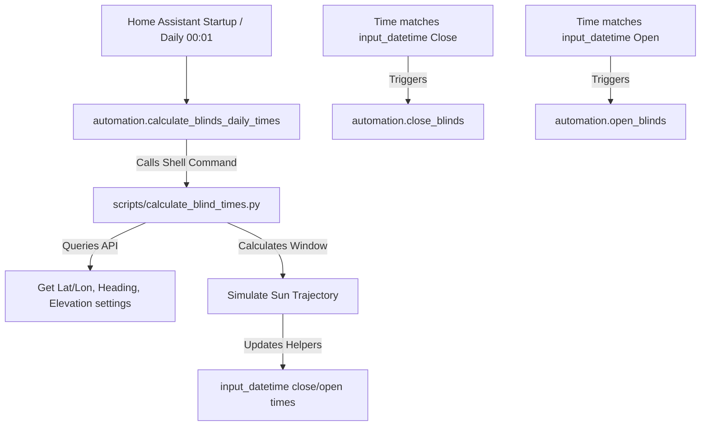

# Adaptive Blinds Automation

This document describes the building-oriented adaptive blinds automation designed to control the north-facing blinds (morning) and west-facing blinds (evening) based on the sun's position and the orientation of the building.

## Overview

The automation calculates daily closing and opening times based on:
1.  **Home Coordinates**: Latitude and longitude retrieved from the Home Assistant config.
2.  **Building Facade Orientation**:
    *   **North Facade**: Heading (azimuth) defined by `input_number.building_north_orientation` (default `29.0°` Manhattan grid).
    *   **West Facade**: Heading calculated as `(building_north_orientation - 90.0) % 360` (default `299.0°`).
3.  **Sun Elevation Limits**:
    *   **Min Elevation**: Minimum elevation above the horizon to trigger closing, defined by `input_number.blinds_min_sun_elevation` (default `5.0°`).
    *   **Max Elevation (West)**: Maximum elevation above the horizon to trigger evening closing, defined by `input_number.blinds_max_sun_elevation_west` (default `30.0°`). This prevents early afternoon closing when the sun is too high to shine deep into the room.

---

## Architecture and Components

### 1. Helper Entities
The following helper entities manage the state and configuration of the automation:
*   `input_boolean.automatic_north_blinds`: Enable/disable morning automation.
*   `input_boolean.automatic_west_blinds`: Enable/disable evening automation.
*   `input_datetime.north_blinds_close_time`: Calculated morning close time.
*   `input_datetime.north_blinds_open_time`: Calculated morning open time.
*   `input_datetime.west_blinds_close_time`: Calculated evening close time.
*   `input_datetime.west_blinds_open_time`: Calculated evening open time.
*   `input_number.building_north_orientation`: North facade heading (azimuth, default `29.0°`).
*   `input_number.blinds_min_sun_elevation`: Min sun elevation above horizon (default `5.0°`).
*   `input_number.blinds_max_sun_elevation_west`: Max sun elevation for evening closing (default `30.0°`).

### 2. Trajectory Calculation Script (`scripts/calculate_blind_times.py`)
A Python script runs daily on the VM to calculate the morning and evening windows:
*   **Morning simulation (North facade)**: Checks minute-by-minute between 4:00 AM and 1:00 PM for times where the sun's azimuth faces the north facade (difference < 90°) and its elevation is above the minimum.
*   **Evening simulation (West facade)**: Checks minute-by-minute between 12:00 PM and 9:00 PM for times where the sun's azimuth faces the west facade (difference < 90°) and its elevation is between the minimum and the maximum west elevation.
*   **API Updates**: Sets the corresponding close and open times or defaults to `00:00:00` if no sunlight window is detected (e.g. in winter).

### 3. Automations (`automation/blinds.yaml`)
*   **Calculate Blinds Daily Times**: Runs the calculation script on startup (with a 10-second delay for entity initialization) and daily at 00:01 AM.
*   **Close/Open North Blinds**: Closes/opens `cover.balcony_north_left` and `cover.balcony_north_right` at the calculated times.
*   **Close/Open West Blinds**: Closes/opens `cover.living_room_left`, `cover.living_room_middle`, and `cover.living_room_right` at the calculated times.
